# Guía de Implementación Frontend - Sistema de Cuotas SIGESDA

**Fecha:** 2025-12-17
**Versión:** 2.0 (Post-Refactoring Fase 7)
**Estado:** ✅ Servidor funcionando en puerto 8000
**Branch:** feature/cuotas-items-system

---

## 📋 Índice

1. [Configuración Inicial](#configuración-inicial)
2. [Arquitectura del Sistema](#arquitectura-del-sistema)
3. [Endpoints Disponibles](#endpoints-disponibles)
4. [Modelos de Datos (DTOs)](#modelos-de-datos)
5. [Flujos Principales](#flujos-principales)
6. [Ejemplos de Integración](#ejemplos-de-integración)
7. [Manejo de Errores](#manejo-de-errores)
8. [FAQ y Troubleshooting](#faq-y-troubleshooting)

---

## 🚀 Configuración Inicial

### Información del Servidor

```yaml
Base URL: http://localhost:8000
Environment: development
Health Check: http://localhost:8000/health
Swagger Docs: http://localhost:8000/api-docs
```

### Headers Requeridos

```javascript
const headers = {
  'Content-Type': 'application/json',
  'Accept': 'application/json'
};
```

### Respuestas Estándar

**Éxito:**
```json
{
  "success": true,
  "data": { /* ... */ }
}
```

**Error:**
```json
{
  "success": false,
  "error": "Mensaje de error descriptivo",
  "details": { /* Opcional */ }
}
```

---

## 🏗️ Arquitectura del Sistema

### Componentes Principales

El sistema de cuotas está dividido en **8 módulos**:

1. **Cuotas** (`/api/cuotas`) - CRUD y generación
2. **Items de Cuota** (`/api/items-cuota`) - Gestión de items configurables
3. **Ajustes Manuales** (`/api/ajustes-cuota`) - Descuentos/recargos por socio
4. **Exenciones** (`/api/exenciones-cuota`) - Sistema de exenciones temporales
5. **Reportes** (`/api/reportes/cuotas`) - Dashboards y estadísticas
6. **Catálogos** (`/api/catalogos/tipos-items`, `/categorias-items`) - Configuración
7. **Historial** (`/api/historial-cuota`) - Auditoría de cambios
8. **Motor de Reglas** (interno) - Aplicación automática de descuentos

### Flujo de Datos

```
┌─────────────┐      ┌──────────────┐      ┌────────────┐
│   Frontend  │ ───> │  API Backend │ ───> │  Database  │
│   (React)   │ <─── │   (Express)  │ <─── │ (Postgres) │
└─────────────┘      └──────────────┘      └────────────┘
```

---

## 🌐 Endpoints Disponibles

### 1. Cuotas - Operaciones CRUD

#### 📝 Crear Cuota Individual
```http
POST /api/cuotas
Content-Type: application/json

{
  "reciboId": 123,
  "categoria": "ACTIVO",
  "mes": 12,
  "anio": 2025,
  "montoBase": 1000,
  "montoActividades": 500,
  "montoTotal": 1500
}
```

**Respuesta:**
```json
{
  "success": true,
  "data": {
    "id": 456,
    "reciboId": 123,
    "categoria": "ACTIVO",
    "mes": 12,
    "anio": 2025,
    "montoBase": 1000,
    "montoActividades": 500,
    "montoTotal": 1500,
    "createdAt": "2025-12-17T10:00:00Z",
    "recibo": {
      "numero": "R-2025-001234",
      "estado": "PENDIENTE",
      "fechaVencimiento": "2026-01-15"
    }
  }
}
```

#### 📋 Listar Cuotas (con filtros y paginación)
```http
GET /api/cuotas?mes=12&anio=2025&categoria=ACTIVO&page=1&limit=20&soloImpagas=true
```

**Query Parameters:**
- `mes` (optional): Filtrar por mes (1-12)
- `anio` (optional): Filtrar por año
- `categoria` (optional): ACTIVO | ESTUDIANTE | JUBILADO | VITALICIO | BENEFACTOR
- `page` (default: 1): Página actual
- `limit` (default: 20): Items por página
- `soloImpagas` (optional): Solo cuotas pendientes/vencidas
- `soloVencidas` (optional): Solo cuotas vencidas
- `ordenarPor` (optional): fecha | monto | categoria | vencimiento
- `orden` (optional): asc | desc

**Respuesta:**
```json
{
  "success": true,
  "data": {
    "data": [
      {
        "id": 1,
        "categoria": "ACTIVO",
        "mes": 12,
        "anio": 2025,
        "montoTotal": 1500,
        "recibo": {
          "numero": "R-2025-001234",
          "estado": "PENDIENTE",
          "receptor": {
            "id": 10,
            "nombre": "Juan",
            "apellido": "Pérez",
            "numeroSocio": "S-001"
          }
        }
      }
    ],
    "total": 150,
    "pages": 8,
    "currentPage": 1
  }
}
```

#### 🔍 Obtener Cuota por ID
```http
GET /api/cuotas/456
```

#### ✏️ Actualizar Cuota
```http
PUT /api/cuotas/456
Content-Type: application/json

{
  "montoBase": 1200,
  "montoActividades": 600
}
```

**⚠️ Restricción:** No se puede modificar si el recibo está PAGADO.

#### 🗑️ Eliminar Cuota
```http
DELETE /api/cuotas/456
```

**⚠️ Restricción:** No se puede eliminar si el recibo está PAGADO o tiene medios de pago registrados.

---

### 2. Generación Masiva de Cuotas

#### ⭐ Generación V2 (Recomendado - Con Items y Motor de Reglas)
```http
POST /api/cuotas/generar-v2
Content-Type: application/json

{
  "mes": 12,
  "anio": 2025,
  "categoriaIds": [1, 2, 3],  // Optional: Si no se envía, genera para todas
  "aplicarDescuentos": true,
  "incluirInactivos": false,
  "observaciones": "Cuotas diciembre 2025"
}
```

**Respuesta:**
```json
{
  "success": true,
  "data": {
    "generated": 150,
    "errors": [],
    "cuotas": [
      {
        "cuotaId": 1001,
        "reciboId": 2001,
        "reciboNumero": "R-2025-002001",
        "socioId": 10,
        "socioNumero": "S-001",
        "socioNombre": "Juan Pérez",
        "categoria": "ACTIVO",
        "montoBase": 1000,
        "montoActividades": 500,
        "montoTotal": 1350,  // Con descuentos aplicados
        "descuentoAplicado": true
      }
    ],
    "resumenDescuentos": {
      "totalSociosConDescuento": 45,
      "montoTotalDescuentos": 15000,
      "reglasAplicadas": {
        "DESCUENTO_ESTUDIANTE": 20,
        "DESCUENTO_FAMILIAR": 15,
        "DESCUENTO_JUBILADO": 10
      }
    }
  }
}
```

#### 📊 Validar Generación (Preview)
```http
GET /api/cuotas/validar/12/2025/generacion?categoriaIds=1,2
```

**Respuesta:**
```json
{
  "success": true,
  "data": {
    "puedeGenerar": true,
    "sociosPorGenerar": 150,
    "cuotasExistentes": 0,
    "warnings": [],
    "sociosSinCategoria": 0,
    "sociosInactivos": 5
  }
}
```

---

### 3. Recálculo y Regeneración

#### 🔄 Recalcular Cuota Individual
```http
POST /api/cuotas/456/recalcular
Content-Type: application/json

{
  "aplicarAjustes": true,
  "aplicarExenciones": true,
  "aplicarDescuentos": true
}
```

**Respuesta:**
```json
{
  "success": true,
  "data": {
    "cuotaOriginal": {
      "id": 456,
      "montoBase": 1000,
      "montoActividades": 500,
      "montoTotal": 1500
    },
    "cuotaRecalculada": {
      "id": 456,
      "montoBase": 1000,
      "montoActividades": 600,
      "montoTotal": 1400
    },
    "cambios": {
      "montoBase": { "antes": 1000, "despues": 1000, "diferencia": 0 },
      "montoActividades": { "antes": 500, "despues": 600, "diferencia": 100 },
      "montoTotal": { "antes": 1500, "despues": 1400, "diferencia": -100 },
      "ajustesAplicados": [
        {
          "ajusteId": 10,
          "concepto": "Descuento por hermanos",
          "tipoAjuste": "DESCUENTO_PORCENTAJE",
          "valor": 10,
          "ajusteCalculado": -100
        }
      ],
      "exencionesAplicadas": []
    }
  }
}
```

#### 🔮 Preview de Recálculo (sin aplicar cambios)
```http
POST /api/cuotas/preview-recalculo
Content-Type: application/json

{
  "mes": 12,
  "anio": 2025,
  "categoriaId": 1,  // Optional
  "personaId": 10,   // Optional
  "aplicarAjustes": true,
  "aplicarExenciones": true,
  "aplicarDescuentos": true
}
```

**Respuesta:**
```json
{
  "success": true,
  "data": {
    "cuotas": [ /* Array de cuotas con cambios proyectados */ ],
    "cambios": [ /* Solo cuotas con cambios */ ],
    "resumen": {
      "totalCuotas": 150,
      "conCambios": 45,
      "sinCambios": 105,
      "totalAjuste": -5000  // Negativo = ahorro para socios
    }
  }
}
```

#### 🔁 Regenerar Cuotas del Período
```http
POST /api/cuotas/regenerar
Content-Type: application/json

{
  "mes": 12,
  "anio": 2025,
  "categoriaId": 1,  // Optional: Regenerar solo una categoría
  "personaId": 10,   // Optional: Regenerar solo un socio
  "aplicarDescuentos": true
}
```

**⚠️ ADVERTENCIA:** Esto **elimina** las cuotas existentes del período y las vuelve a generar. Solo funciona con cuotas NO PAGADAS.

#### 📊 Comparar Cuota Actual vs Recalculada
```http
GET /api/cuotas/456/comparar
```

---

### 4. Items de Cuota

#### 📋 Obtener Items de una Cuota
```http
GET /api/cuotas/456/items
```

**Respuesta:**
```json
{
  "success": true,
  "data": {
    "items": [
      {
        "id": 1001,
        "tipoItem": {
          "id": 1,
          "codigo": "CUOTA_BASE_SOCIO",
          "nombre": "Cuota Base",
          "categoriaItem": {
            "codigo": "BASE",
            "nombre": "Base"
          }
        },
        "concepto": "Cuota base ACTIVO",
        "monto": 1000,
        "cantidad": 1,
        "esAutomatico": true,
        "esEditable": false
      },
      {
        "id": 1002,
        "tipoItem": {
          "id": 2,
          "codigo": "ACTIVIDAD_INDIVIDUAL",
          "nombre": "Actividad",
          "categoriaItem": {
            "codigo": "ACTIVIDAD",
            "nombre": "Actividades"
          }
        },
        "concepto": "Coro",
        "monto": 500,
        "cantidad": 1,
        "esAutomatico": true,
        "esEditable": false,
        "metadata": {
          "actividadId": 20,
          "participacionId": 100
        }
      },
      {
        "id": 1003,
        "tipoItem": {
          "id": 5,
          "codigo": "DESCUENTO_GENERAL",
          "nombre": "Descuento",
          "categoriaItem": {
            "codigo": "DESCUENTO",
            "nombre": "Descuentos"
          }
        },
        "concepto": "Descuento estudiante 40%",
        "monto": -400,
        "cantidad": 1,
        "porcentaje": 40,
        "esAutomatico": true,
        "esEditable": false
      }
    ],
    "totales": {
      "subtotal": 1500,
      "descuentos": -400,
      "recargos": 0,
      "total": 1100
    }
  }
}
```

#### 📊 Desglose Detallado (agrupado por categoría)
```http
GET /api/cuotas/456/items/desglose
```

**Respuesta:**
```json
{
  "success": true,
  "data": {
    "desglose": {
      "BASE": {
        "items": [ /* Items de cuota base */ ],
        "subtotal": 1000
      },
      "ACTIVIDAD": {
        "items": [ /* Items de actividades */ ],
        "subtotal": 500
      },
      "DESCUENTO": {
        "items": [ /* Items de descuentos */ ],
        "subtotal": -400
      }
    },
    "totales": {
      "base": 1000,
      "actividades": 500,
      "descuentos": -400,
      "recargos": 0,
      "total": 1100
    }
  }
}
```

#### ➕ Agregar Item Manual
```http
POST /api/cuotas/456/items
Content-Type: application/json

{
  "tipoItemId": 10,
  "concepto": "Recargo por mora",
  "monto": 100,
  "cantidad": 1,
  "esEditable": true,
  "metadata": {
    "diasMora": 15,
    "porcentajeMora": 10
  }
}
```

---

### 5. Ajustes Manuales

#### 📝 Crear Ajuste Manual
```http
POST /api/ajustes-cuota
Content-Type: application/json

{
  "personaId": 10,
  "tipoAjuste": "DESCUENTO_PORCENTAJE",  // DESCUENTO_FIJO | DESCUENTO_PORCENTAJE | RECARGO_FIJO | RECARGO_PORCENTAJE | MONTO_FIJO_TOTAL
  "valor": 10,
  "concepto": "Descuento por hermanos",
  "motivo": "Tiene 2 hermanos inscritos",
  "fechaInicio": "2025-12-01",
  "fechaFin": "2026-12-31",  // Optional: null = permanente
  "aplicaA": "TOTAL_CUOTA",  // TOTAL_CUOTA | BASE | ACTIVIDADES | ITEMS_ESPECIFICOS
  "itemsAfectados": null,  // Array de IDs si aplicaA === ITEMS_ESPECIFICOS
  "activo": true
}
```

**Respuesta:**
```json
{
  "success": true,
  "data": {
    "id": 50,
    "personaId": 10,
    "tipoAjuste": "DESCUENTO_PORCENTAJE",
    "valor": 10,
    "concepto": "Descuento por hermanos",
    "activo": true,
    "fechaInicio": "2025-12-01",
    "fechaFin": "2026-12-31",
    "createdAt": "2025-12-17T10:00:00Z"
  }
}
```

#### 📋 Listar Ajustes de una Persona
```http
GET /api/ajustes-cuota/persona/10?soloActivos=true
```

#### ✏️ Actualizar Ajuste
```http
PUT /api/ajustes-cuota/50
Content-Type: application/json

{
  "valor": 15,
  "motivo": "Actualizado a 3 hermanos"
}
```

#### ❌ Desactivar Ajuste (soft delete)
```http
DELETE /api/ajustes-cuota/50
```

---

### 6. Exenciones

#### 📝 Solicitar Exención
```http
POST /api/exenciones-cuota
Content-Type: application/json

{
  "personaId": 10,
  "tipoExencion": "TOTAL",  // TOTAL | PARCIAL
  "motivoExencion": "SITUACION_ECONOMICA",  // BECA | SOCIO_FUNDADOR | SOCIO_HONORARIO | SITUACION_ECONOMICA | etc.
  "porcentaje": 100,
  "fechaInicio": "2025-12-01",
  "fechaFin": "2026-06-30",
  "justificacion": "Pérdida de empleo, situación económica difícil",
  "documentacionAdjunta": "informe_social_001.pdf",
  "observaciones": "Revisar en 6 meses"
}
```

**Estados del workflow:**
- `PENDIENTE_APROBACION` → Estado inicial
- `APROBADA` → Aprobada pero aún no vigente
- `VIGENTE` → Activa y aplicándose
- `VENCIDA` → Expiró automáticamente
- `REVOCADA` → Cancelada antes de vencer
- `RECHAZADA` → No aprobada

#### ✅ Aprobar Exención
```http
POST /api/exenciones-cuota/50/aprobar
Content-Type: application/json

{
  "aprobadoPor": "Director",
  "observacionesAprobacion": "Aprobada por 6 meses"
}
```

#### ❌ Rechazar Exención
```http
POST /api/exenciones-cuota/50/rechazar
Content-Type: application/json

{
  "rechazadoPor": "Director",
  "motivoRechazo": "Documentación insuficiente"
}
```

#### 🔒 Revocar Exención
```http
POST /api/exenciones-cuota/50/revocar
Content-Type: application/json

{
  "motivoRevocacion": "Situación económica normalizada",
  "usuario": "Administrador"
}
```

#### 🔍 Verificar si tiene Exención Activa
```http
GET /api/exenciones-cuota/check/10/2025-12-15
```

**Respuesta:**
```json
{
  "success": true,
  "data": {
    "tieneExencion": true,
    "porcentaje": 100,
    "exencion": {
      "id": 50,
      "tipoExencion": "TOTAL",
      "motivoExencion": "SITUACION_ECONOMICA",
      "estado": "VIGENTE",
      "fechaInicio": "2025-12-01",
      "fechaFin": "2026-06-30"
    }
  }
}
```

---

### 7. Reportes y Dashboards

#### 📊 Dashboard General
```http
GET /api/reportes/cuotas/dashboard?mes=12&anio=2025
```

**Respuesta:**
```json
{
  "success": true,
  "data": {
    "periodo": {
      "mes": 12,
      "anio": 2025,
      "nombreMes": "Diciembre"
    },
    "metricas": {
      "totalCuotas": 150,
      "totalRecaudado": 135000,
      "totalPendiente": 45000,
      "tasaCobro": 75.0,
      "promedioMonto": 900,
      "totalDescuentos": 15000
    },
    "distribucion": {
      "porCategoria": {
        "ACTIVO": { "cantidad": 100, "monto": 100000 },
        "ESTUDIANTE": { "cantidad": 30, "monto": 18000 },
        "JUBILADO": { "cantidad": 20, "monto": 17000 }
      },
      "porEstado": {
        "PAGADO": { "cantidad": 112, "monto": 135000 },
        "PENDIENTE": { "cantidad": 25, "monto": 30000 },
        "VENCIDO": { "cantidad": 13, "monto": 15000 }
      }
    },
    "tendencias": {
      "variacionMesAnterior": 5.2,
      "proyeccionRecaudacion": 180000
    }
  }
}
```

#### 📈 Reporte por Categoría
```http
GET /api/reportes/cuotas/categoria?mes=12&anio=2025&categoriaId=1&incluirDetalle=true
```

#### 💰 Análisis de Descuentos
```http
GET /api/reportes/cuotas/descuentos?mes=12&anio=2025&tipoDescuento=todos
```

**Query Parameters:**
- `tipoDescuento`: todos | ajustes | exenciones | reglas

**Respuesta:**
```json
{
  "success": true,
  "data": {
    "resumen": {
      "totalDescuentos": 15000,
      "totalSociosBeneficiados": 45,
      "promedioDescuento": 333.33,
      "porcentajeDelTotal": 10.0
    },
    "porTipo": {
      "ajustes": { "cantidad": 15, "monto": 5000 },
      "exenciones": { "cantidad": 5, "monto": 3000 },
      "reglas": { "cantidad": 25, "monto": 7000 }
    },
    "topDescuentos": [
      {
        "personaId": 10,
        "nombre": "Juan Pérez",
        "montoDescuento": 600,
        "tipo": "DESCUENTO_ESTUDIANTE"
      }
    ]
  }
}
```

#### 🎓 Reporte de Exenciones
```http
GET /api/reportes/cuotas/exenciones?estado=VIGENTE&motivoExencion=TODOS&incluirHistorico=false
```

#### 📊 Reporte Comparativo entre Períodos
```http
GET /api/reportes/cuotas/comparativo?mesInicio=11&anioInicio=2025&mesFin=12&anioFin=2025
```

#### 💵 Estadísticas de Recaudación
```http
GET /api/reportes/cuotas/recaudacion?mes=12&anio=2025
```

#### 📥 Exportar Reporte
```http
POST /api/reportes/cuotas/exportar
Content-Type: application/json

{
  "tipoReporte": "dashboard",  // dashboard | categoria | descuentos | etc.
  "formato": "PDF",  // PDF | EXCEL | CSV
  "parametros": {
    "mes": 12,
    "anio": 2025
  }
}
```

---

### 8. Consultas Especializadas

#### 🔍 Búsqueda Avanzada
```http
GET /api/cuotas/search/avanzada?socio=Juan&estado=PENDIENTE&montoMin=500&montoMax=2000
```

#### 📅 Períodos Disponibles
```http
GET /api/cuotas/periodos/disponibles
```

**Respuesta:**
```json
{
  "success": true,
  "data": {
    "periodos": [
      { "mes": 12, "anio": 2025, "nombreMes": "Diciembre", "totalCuotas": 150 },
      { "mes": 11, "anio": 2025, "nombreMes": "Noviembre", "totalCuotas": 148 }
    ]
  }
}
```

#### 💳 Cuotas por Socio
```http
GET /api/cuotas/socio/10?limit=12
```

#### 📄 Cuota por Recibo
```http
GET /api/cuotas/recibo/2001
```

#### 📅 Cuotas por Período
```http
GET /api/cuotas/periodo/12/2025?categoria=ACTIVO
```

---

## 📦 Modelos de Datos (DTOs)

### Cuota
```typescript
interface Cuota {
  id: number;
  reciboId: number;
  categoria: CategoriaSocio;
  mes: number;              // 1-12
  anio: number;
  montoBase: number;
  montoActividades: number;
  montoTotal: number;
  createdAt: Date;
  updatedAt: Date;
  recibo: Recibo;
}

type CategoriaSocio =
  | 'ACTIVO'
  | 'ESTUDIANTE'
  | 'JUBILADO'
  | 'VITALICIO'
  | 'BENEFACTOR';
```

### ItemCuota
```typescript
interface ItemCuota {
  id: number;
  cuotaId: number;
  tipoItemId: number;
  concepto: string;
  monto: number;
  cantidad: number;
  porcentaje?: number | null;
  esAutomatico: boolean;
  esEditable: boolean;
  metadata?: any;
  createdAt: Date;
  updatedAt: Date;
  tipoItem: TipoItemCuota;
}

interface TipoItemCuota {
  id: number;
  codigo: string;
  nombre: string;
  categoriaItemId: number;
  categoriaItem: CategoriaItem;
  activo: boolean;
}

interface CategoriaItem {
  codigo: 'BASE' | 'ACTIVIDAD' | 'DESCUENTO' | 'RECARGO' | 'ADICIONAL';
  nombre: string;
}
```

### AjusteCuotaSocio
```typescript
interface AjusteCuotaSocio {
  id: number;
  personaId: number;
  tipoAjuste: TipoAjusteCuota;
  valor: number;
  concepto: string;
  motivo?: string;
  fechaInicio: Date;
  fechaFin?: Date | null;
  aplicaA: AplicaA;
  itemsAfectados?: number[];
  activo: boolean;
  createdAt: Date;
  updatedAt: Date;
}

type TipoAjusteCuota =
  | 'DESCUENTO_FIJO'
  | 'DESCUENTO_PORCENTAJE'
  | 'RECARGO_FIJO'
  | 'RECARGO_PORCENTAJE'
  | 'MONTO_FIJO_TOTAL';

type AplicaA =
  | 'TOTAL_CUOTA'
  | 'BASE'
  | 'ACTIVIDADES'
  | 'ITEMS_ESPECIFICOS';
```

### ExencionCuota
```typescript
interface ExencionCuota {
  id: number;
  personaId: number;
  tipoExencion: 'TOTAL' | 'PARCIAL';
  motivoExencion: MotivoExencion;
  porcentaje: number;  // 0-100
  fechaInicio: Date;
  fechaFin?: Date;
  estado: EstadoExencion;
  justificacion: string;
  documentacionAdjunta?: string;
  observaciones?: string;
  aprobadoPor?: string;
  rechazadoPor?: string;
  createdAt: Date;
  updatedAt: Date;
}

type EstadoExencion =
  | 'PENDIENTE_APROBACION'
  | 'APROBADA'
  | 'VIGENTE'
  | 'VENCIDA'
  | 'REVOCADA'
  | 'RECHAZADA';

type MotivoExencion =
  | 'BECA'
  | 'SOCIO_FUNDADOR'
  | 'SOCIO_HONORARIO'
  | 'SITUACION_ECONOMICA'
  | 'MERITO_ACADEMICO'
  | 'COLABORACION_INSTITUCIONAL'
  | 'EMERGENCIA_FAMILIAR'
  | 'OTRO';
```

### Recibo
```typescript
interface Recibo {
  id: number;
  numero: string;           // Auto-generado: R-YYYY-NNNNNN
  tipo: 'CUOTA' | 'VENTA' | 'DONACION' | 'OTRO';
  receptorId: number;
  emisorId?: number;
  importe: number;
  concepto: string;
  fecha: Date;
  fechaVencimiento?: Date;
  estado: EstadoRecibo;
  observaciones?: string;
  createdAt: Date;
  updatedAt: Date;
  receptor: Persona;
  mediosPago: MedioPago[];
}

type EstadoRecibo =
  | 'PENDIENTE'
  | 'PAGADO'
  | 'VENCIDO'
  | 'ANULADO';
```

---

## 🔄 Flujos Principales

### Flujo 1: Generación Mensual de Cuotas

```mermaid
graph TD
    A[Inicio: Admin inicia generación] --> B[Validar período]
    B --> C{¿Ya existen cuotas?}
    C -->|Sí| D[Mostrar warning]
    C -->|No| E[POST /api/cuotas/generar-v2]
    D --> E
    E --> F[Sistema genera cuotas]
    F --> G[Aplica motor de reglas]
    G --> H[Aplica ajustes manuales]
    H --> I[Aplica exenciones vigentes]
    I --> J[Crea recibos]
    J --> K{¿Errores?}
    K -->|Sí| L[Muestra log de errores]
    K -->|No| M[Muestra resumen]
    M --> N[Fin]
    L --> N
```



**Código de Ejemplo (React):**
```typescript
async function generarCuotasMes(mes: number, anio: number) {
  try {
    // 1. Validar primero
    const validacion = await fetch(
      `http://localhost:8000/api/cuotas/validar/${mes}/${anio}/generacion`
    );
    const { data: validData } = await validacion.json();

    if (validData.cuotasExistentes > 0) {
      const confirmar = window.confirm(
        `Ya existen ${validData.cuotasExistentes} cuotas. ¿Continuar?`
      );
      if (!confirmar) return;
    }

    // 2. Generar
    const response = await fetch('http://localhost:8000/api/cuotas/generar-v2', {
      method: 'POST',
      headers: { 'Content-Type': 'application/json' },
      body: JSON.stringify({
        mes,
        anio,
        aplicarDescuentos: true,
        incluirInactivos: false
      })
    });

    const { data } = await response.json();

    // 3. Mostrar resultados
    console.log(`✅ ${data.generated} cuotas generadas`);
    console.log(`💰 Descuentos: $${data.resumenDescuentos.montoTotalDescuentos}`);

    if (data.errors.length > 0) {
      console.warn('⚠️ Errores:', data.errors);
    }

    return data;
  } catch (error) {
    console.error('Error generando cuotas:', error);
    throw error;
  }
}
```

### Flujo 2: Visualización de Cuota con Items

```typescript
async function obtenerDetalleCuota(cuotaId: number) {
  try {
    // 1. Obtener cuota
    const cuotaRes = await fetch(`http://localhost:8000/api/cuotas/${cuotaId}`);
    const { data: cuota } = await cuotaRes.json();

    // 2. Obtener desglose de items
    const itemsRes = await fetch(`http://localhost:8000/api/cuotas/${cuotaId}/items/desglose`);
    const { data: desglose } = await itemsRes.json();

    return {
      cuota,
      desglose
    };
  } catch (error) {
    console.error('Error obteniendo cuota:', error);
    throw error;
  }
}

// Componente React
function DetalleCuotaComponent({ cuotaId }: { cuotaId: number }) {
  const [cuota, setCuota] = useState(null);
  const [desglose, setDesglose] = useState(null);

  useEffect(() => {
    obtenerDetalleCuota(cuotaId).then(data => {
      setCuota(data.cuota);
      setDesglose(data.desglose);
    });
  }, [cuotaId]);

  if (!cuota || !desglose) return <Loading />;

  return (
    <div className="cuota-detalle">
      <h2>Cuota #{cuota.id}</h2>
      <p>Recibo: {cuota.recibo.numero}</p>
      <p>Estado: {cuota.recibo.estado}</p>

      <h3>Desglose:</h3>
      {Object.entries(desglose.desglose).map(([categoria, datos]) => (
        <div key={categoria}>
          <h4>{categoria}</h4>
          <ul>
            {datos.items.map(item => (
              <li key={item.id}>
                {item.concepto}: ${item.monto}
              </li>
            ))}
          </ul>
          <strong>Subtotal: ${datos.subtotal}</strong>
        </div>
      ))}

      <h3>Total: ${desglose.totales.total}</h3>
    </div>
  );
}
```

### Flujo 3: Aplicar Ajuste Manual

```typescript
async function aplicarAjusteManual(personaId: number, ajuste: any) {
  try {
    // 1. Crear ajuste
    const response = await fetch('http://localhost:8000/api/ajustes-cuota', {
      method: 'POST',
      headers: { 'Content-Type': 'application/json' },
      body: JSON.stringify({
        personaId,
        tipoAjuste: ajuste.tipo,
        valor: ajuste.valor,
        concepto: ajuste.concepto,
        motivo: ajuste.motivo,
        fechaInicio: ajuste.fechaInicio,
        fechaFin: ajuste.fechaFin,
        aplicaA: 'TOTAL_CUOTA',
        activo: true
      })
    });

    const { data: ajusteCreado } = await response.json();

    // 2. Recalcular cuotas afectadas
    const cuotasResponse = await fetch(
      `http://localhost:8000/api/cuotas/socio/${personaId}?limit=1`
    );
    const { data: cuotas } = await cuotasResponse.json();

    if (cuotas.length > 0) {
      const cuotaActual = cuotas[0];

      // 3. Recalcular cuota actual
      await fetch(`http://localhost:8000/api/cuotas/${cuotaActual.id}/recalcular`, {
        method: 'POST',
        headers: { 'Content-Type': 'application/json' },
        body: JSON.stringify({
          aplicarAjustes: true,
          aplicarExenciones: true,
          aplicarDescuentos: true
        })
      });
    }

    return ajusteCreado;
  } catch (error) {
    console.error('Error aplicando ajuste:', error);
    throw error;
  }
}
```

### Flujo 4: Workflow de Exenciones

```typescript
async function gestionarExencion(personaId: number, exencion: any) {
  try {
    // 1. Solicitar exención
    const response = await fetch('http://localhost:8000/api/exenciones-cuota', {
      method: 'POST',
      headers: { 'Content-Type': 'application/json' },
      body: JSON.stringify({
        personaId,
        tipoExencion: exencion.tipo,
        motivoExencion: exencion.motivo,
        porcentaje: exencion.porcentaje,
        fechaInicio: exencion.fechaInicio,
        fechaFin: exencion.fechaFin,
        justificacion: exencion.justificacion
      })
    });

    const { data: exencionCreada } = await response.json();
    console.log('✅ Exención solicitada:', exencionCreada.id);

    // Estado: PENDIENTE_APROBACION

    // 2. Aprobar exención (admin)
    const aprobacion = await fetch(
      `http://localhost:8000/api/exenciones-cuota/${exencionCreada.id}/aprobar`,
      {
        method: 'POST',
        headers: { 'Content-Type': 'application/json' },
        body: JSON.stringify({
          aprobadoPor: 'Director',
          observacionesAprobacion: 'Aprobada'
        })
      }
    );

    console.log('✅ Exención aprobada');

    // Estado: APROBADA → VIGENTE (automático si fechaInicio <= hoy)

    return exencionCreada;
  } catch (error) {
    console.error('Error gestionando exención:', error);
    throw error;
  }
}
```

---

## ⚠️ Manejo de Errores

### Códigos de Estado HTTP

```typescript
const HTTP_STATUS = {
  200: 'OK',
  201: 'Created',
  400: 'Bad Request - Datos inválidos',
  404: 'Not Found - Recurso no encontrado',
  409: 'Conflict - Duplicado o conflicto',
  500: 'Internal Server Error'
};
```

### Errores Comunes y Soluciones

#### 1. "No se puede modificar una cuota de un recibo pagado"
**Causa:** Intentar editar/eliminar cuota con recibo PAGADO
**Solución:** Validar estado antes de permitir edición

```typescript
function puedeEditarCuota(cuota: Cuota): boolean {
  return cuota.recibo.estado !== 'PAGADO';
}
```

#### 2. "No hay socios pendientes para generar cuotas en este período"
**Causa:** Todas las cuotas del período ya fueron generadas
**Solución:** Usar endpoint de validación antes de generar

#### 3. "La fecha de fin debe ser posterior a la fecha de inicio"
**Causa:** Fechas inválidas en ajustes/exenciones
**Solución:** Validar en frontend antes de enviar

```typescript
function validarFechas(inicio: Date, fin: Date | null): boolean {
  if (!fin) return true;  // Sin fecha fin es válido
  return fin > inicio;
}
```

#### 4. "Categoría con código X no encontrada"
**Causa:** Código de categoría inválido
**Solución:** Usar catálogo de categorías disponible

```typescript
async function obtenerCategorias() {
  const response = await fetch('http://localhost:8000/api/catalogos/categorias-socios');
  return response.json();
}
```

---

## 🧪 FAQ y Troubleshooting

### P: ¿Cómo sé si una cuota se puede editar?
**R:** Una cuota se puede editar solo si su recibo NO está en estado `PAGADO`. Verificar con `cuota.recibo.estado !== 'PAGADO'`.

### P: ¿Cuál es la diferencia entre ajustes y exenciones?
**R:**
- **Ajustes:** Descuentos/recargos automáticos por período, se aplican en cada generación
- **Exenciones:** Requieren aprobación, workflow de estados, son temporales y auditadas

### P: ¿Cómo funcionan los descuentos automáticos?
**R:** El motor de reglas aplica automáticamente descuentos según reglas configuradas (estudiante, jubilado, familiar, etc.). Se aplican en `generar-v2` si `aplicarDescuentos: true`.

### P: ¿Puedo regenerar cuotas ya pagadas?
**R:** NO. La regeneración solo funciona con cuotas NO PAGADAS. Esto previene pérdida de datos de pagos.

### P: ¿Qué es la diferencia entre `generar` y `generar-v2`?
**R:**
- `generar` (legacy): Sistema antiguo, descuentos hardcodeados
- `generar-v2` (recomendado): Sistema moderno con items configurables + motor de reglas

### P: ¿Cómo ver el historial de cambios de una cuota?
**R:** Usar endpoint: `GET /api/historial-cuota?cuotaId=456`

---

## 📝 Notas Finales

### Próximas Mejoras

1. **Swagger/OpenAPI:** Documentación interactiva en `/api-docs` (warning actual en item-cuota, se corregirá)
2. **WebSockets:** Notificaciones en tiempo real de generación de cuotas
3. **Caché:** Redis para mejorar performance de reportes
4. **Export:** Formatos adicionales (PDF, Excel) para reportes

### Contacto y Soporte

- **Repositorio:** `feature/cuotas-items-system` branch
- **Logs:** `/tmp/server.log` (desarrollo)
- **Health Check:** `http://localhost:8000/health`

---

**Última actualización:** 2025-12-17
**Versión del sistema:** 2.0 (Post-Refactoring)
**Estado:** ✅ Listo para integración frontend

